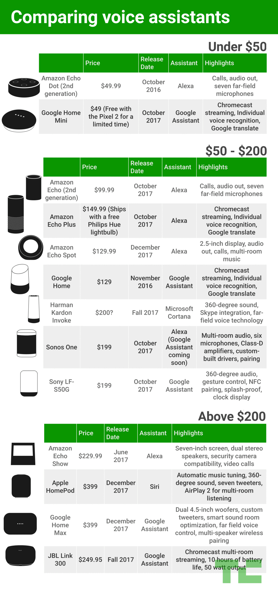

# Comparing The Top Smart Home Assistants In The Market

The _Smart Home Assistant_ is really starting to make a name for itself. **Amazon** is currently the industry leader. However, as the industry starts to get more and more prevalent, companies like **Google**, **Sonos**, and **Apple** are throwing their hat in the ring. _TechCrunch_ has produced an [article](https://techcrunch.com/2017/10/08/comparing-alexa-google-assistant-cortana-and-siri-smart-speakers/) to help customer's pick the assistant that works best for them:

> "The burgeoning category can be a tough one to navigate. A lot of picking the right speaker for your own needs comes down to your assistant of choice ... Some focus on premium sound, some feature screens, and some even let you choose between multiple assistants."

Here is a side-by-side comparison chart of the leading smart home devices:

Here is additional information from different user reviews:
- Sounds as if the **Amazon Echo Dot** is equivalent to the Echo in every way except for its sound quality, and at around _$100 dollars cheaper_. [(source)](https://thewirecutter.com/reviews/amazon-echo-vs-google-home/)
- It is not clear whether or not **Amazon** and **Google** are  [listening in on your conversations](http://www.businessinsider.com/best-smart-speaker-amazon-echo), even if they are not being asked to listen.
- [Echo is the leader right now, but other companies are competing to take the throne](https://www.cnet.com/news/apple-homepod-vs-amazon-echo-vs-google-home/)
