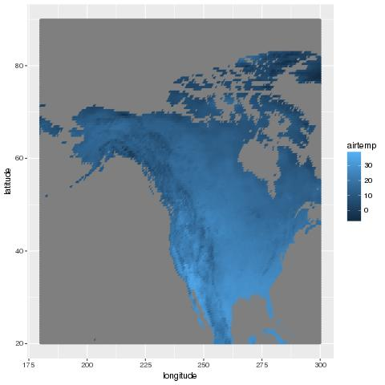
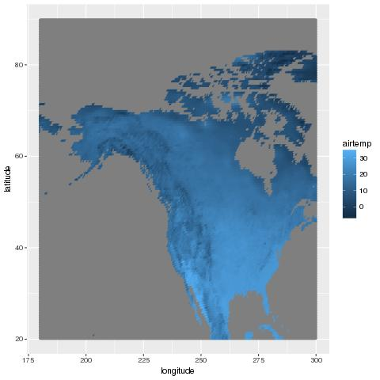
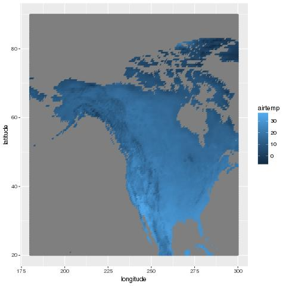
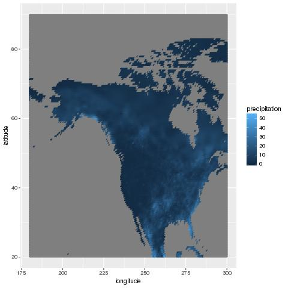
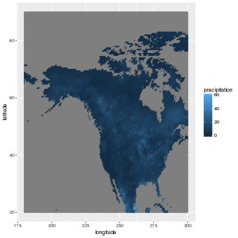
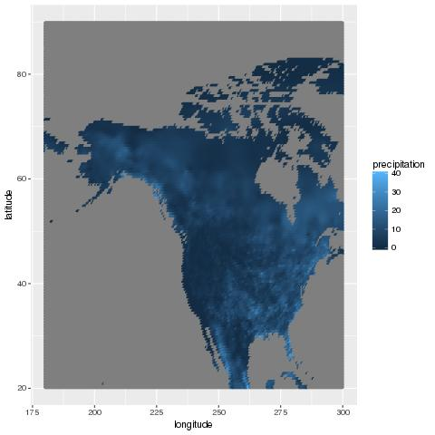

# Climate Report

## North American Temperature and Precipitation, 1960-2014

### Temperature

####**1960 Temperature Map**

####**1987 Temperature Map**

####**2014 Temperature Map**

The first thing that stands out when viewing all three temperature plots is that the temperature seems to increase as you move farther down South. This is understandable because the Southern part of North America is closer to the equator, which is the warmest area of the world, on average. The temperature patterns look reasonable because there should not have been any significant change in the temperature of North America in the course of _40-50 years_. The difference that stands out the most is that it looks like the year **1987** might have been warmer than the other two years, overall. The height of the temperature is not concentrated in the South (Mexico). In **1987**, we are seeing temperatures in the _30's_ (Celsius) in most of the United States and crawling into Canada.

### Precipitation

####**1960 Precipitation Map**

####**1987 Precipitation Map**

####**2014 Precipitation Map**

When viewing the three years of precipitation, there is a trend that most of the rainfall happens on the Eastern side of the United States. This makes me curious because, as a Seattle native, I always hear about how Seattle is considered the _"rainy city"_. However, this does make sense because all three years of data are taken during the summer time, when it is actually nice in Seattle. By looking at the data, it seems that **1987** was also the year where there was the fewest amount of precipitation over all of North America. This is understandable because it is stated in the analysis for temperature that **1987** was the warmest year of the three for all of North America. This can link to a positive relationship between temperature and precipitation. _When it is warmer out, there tends to be less rainfall_.

### Note: 

you cannot do any conclusions about long-term trend based on just 3
figures.  If you are interested, you are welcome to explore long-term
trends in these data, but be sure to use more suitable methods.
