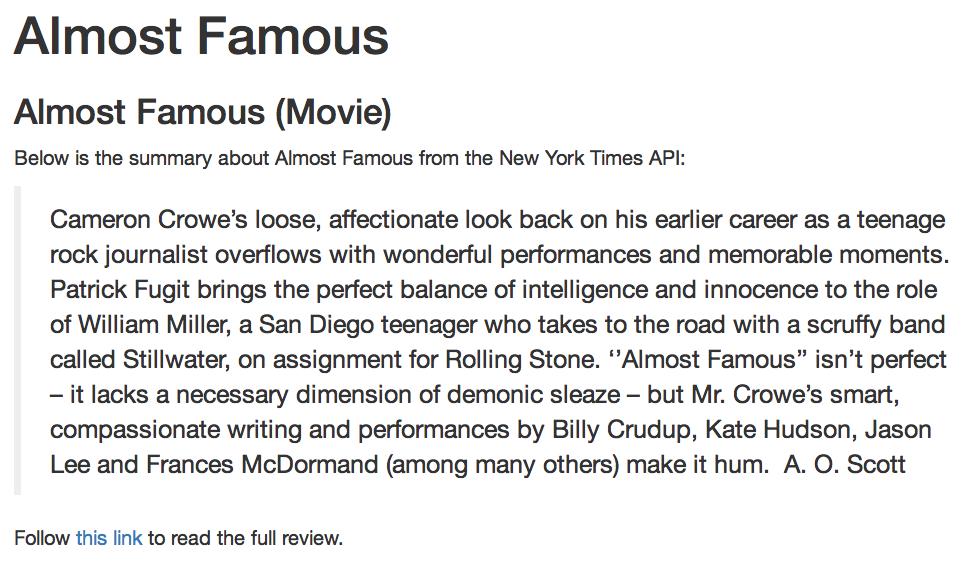

# Exercise-1
In this exercise, you'll practice building a dynamic report using the [New York Times API](https://developer.nytimes.com/) to fetch movie reviews. To learn more about the API, see the [developer console](https://developer.nytimes.com/movie_reviews_v2.json). The dynamic report you'll be building will look like this:

You'll work across multiple files

## `api-keys.R`
In this file, you'll store your API key in a variable to be loaded into your R Script

## `.gitignore`
Make sure to add your `api-keys.R` file to your `.gitignore` file to keep your keys hidden!

## `analysis.R`
In this file, you'll do the following (it's already done for you for the sake of demonstration)
- Store the name of a (popular) movie in a variable `movie`
- Create a new variable `movie.info` by passing your `movie` variable into a function that retrieves information from the NYT API (more instructions in the `analysis.R`) file

## `index.Rmd`
In this file, you'll read in (i.e., `source()`) the files above. Then, use R Markdown syntax to reference the variables that you created in the files. Specifically, you should:

- Display the name of your movie (`movie`) in a **top-level header**
- Display the headline of the review in a **second-level header**
- Display the summary text of the review in a **blockquote**
- Provide a **link** to the full movie review

## Knitting
Once you've done these steps, you should `knit` your document to create a file `index.html`.

As in previous exercises, you should fork and clone this repository, follow the instructions in `exercise.R` file, then `add` and `commit` your changes so that you can `push` them back up to Github.
